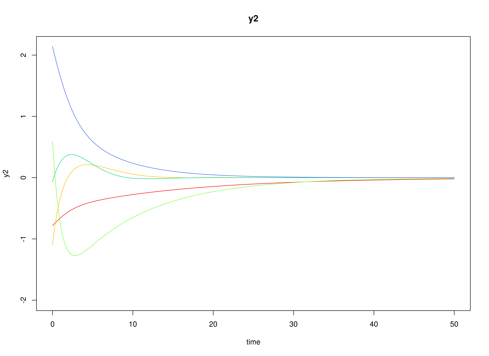
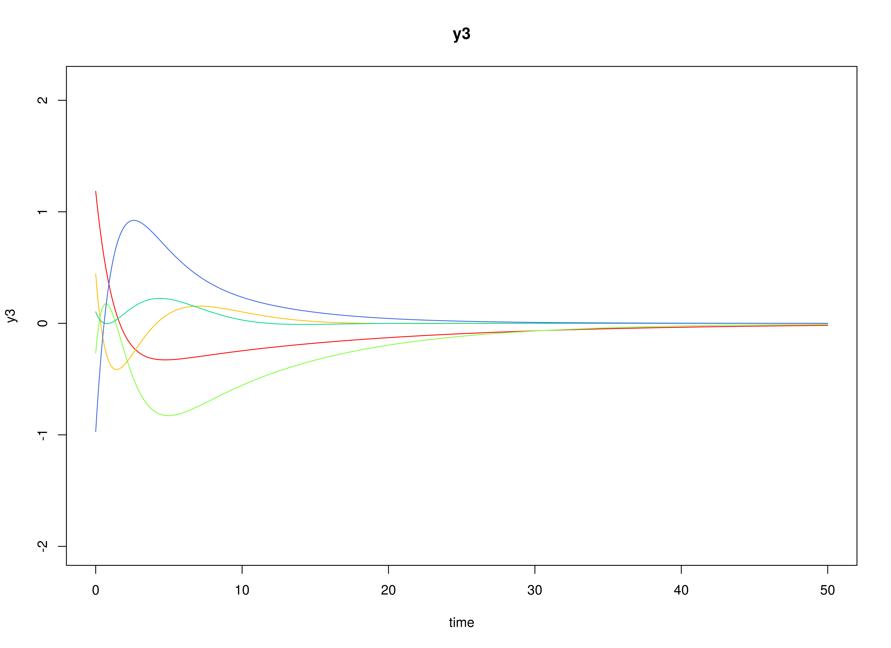

## Model

The measurement model is given by
\begin{equation}
  \mathbf{y}_{i, t}
  =
  \boldsymbol{\nu}
  +
  \boldsymbol{\Lambda}
  \boldsymbol{\eta}_{i, t}
  +
  \boldsymbol{\varepsilon}_{i, t},
  \quad
  \mathrm{with}
  \quad
  \boldsymbol{\varepsilon}_{i, t}
  \sim
  \mathcal{N}
  \left(
  \mathbf{0},
  \boldsymbol{\Theta}
  \right)
\end{equation}
where
$\mathbf{y}_{i, t}$,
$\boldsymbol{\eta}_{i, t}$,
and
$\boldsymbol{\varepsilon}_{i, t}$
are random variables
and
$\boldsymbol{\nu}$,
$\boldsymbol{\Lambda}$,
and
$\boldsymbol{\Theta}$
are model parameters.
$\mathbf{y}_{i, t}$
represents a vector of observed random variables,
$\boldsymbol{\eta}_{i, t}$
a vector of latent random variables,
and
$\boldsymbol{\varepsilon}_{i, t}$
a vector of random measurement errors,
at time $t$ and individual $i$.
$\boldsymbol{\nu}$
denotes a vector of intercepts,
$\boldsymbol{\Lambda}$
a matrix of factor loadings,
and
$\boldsymbol{\Theta}$
the covariance matrix of
$\boldsymbol{\varepsilon}$.

An alternative representation of the measurement error
is given by
\begin{equation}
  \boldsymbol{\varepsilon}_{i, t}
  =
  \boldsymbol{\Theta}^{\frac{1}{2}}
  \mathbf{z}_{i, t},
  \quad
  \mathrm{with}
  \quad
  \mathbf{z}_{i, t}
  \sim
  \mathcal{N}
  \left(
  \mathbf{0},
  \mathbf{I}
  \right)
\end{equation}
where
$\mathbf{z}_{i, t}$ is a vector of
independent standard normal random variables and
$\left( \boldsymbol{\Theta}^{\frac{1}{2}} \right) \left( \boldsymbol{\Theta}^{\frac{1}{2}} \right)^{\prime} = \boldsymbol{\Theta}$ .

The dynamic structure is given by
\begin{equation}
  \mathrm{d} \boldsymbol{\eta}_{i, t}
  =
  \boldsymbol{\Phi}
  \left(
  \boldsymbol{\eta}_{i, t}
  -
  \boldsymbol{\mu}
  \right)
  \mathrm{d}t
  +
  \boldsymbol{\Sigma}^{\frac{1}{2}}
  \mathrm{d}
  \mathbf{W}_{i, t}
\end{equation}
where
$\boldsymbol{\mu}$
is the long-term mean or equilibrium level,
$\boldsymbol{\Phi}$
is the rate of mean reversion,
determining how quickly the variable returns to its mean,
$\boldsymbol{\Sigma}$
is the matrix of volatility
or randomness in the process, and
$\mathrm{d}\boldsymbol{W}$
is a Wiener process or Brownian motion,
which represents random fluctuations.

## Data Generation

### Notation

Let $t = 1000$ be the number of time points and $n = 100$ be the number of individuals.

Let the measurement model intecept vector $\boldsymbol{\nu}$ be given by

\begin{equation}
\boldsymbol{\nu}
=
\left(
\begin{array}{c}
  0 \\
  0 \\
  0 \\
\end{array}
\right) .
\end{equation}

Let the factor loadings matrix $\boldsymbol{\Lambda}$ be given by

\begin{equation}
\boldsymbol{\Lambda}
=
\left(
\begin{array}{ccc}
  1 & 0 & 0 \\
  0 & 1 & 0 \\
  0 & 0 & 1 \\
\end{array}
\right) .
\end{equation}

Let the measurement error covariance matrix $\boldsymbol{\Theta}$ be given by

\begin{equation}
\boldsymbol{\Theta}
=
\left(
\begin{array}{ccc}
  0 & 0 & 0 \\
  0 & 0 & 0 \\
  0 & 0 & 0 \\
\end{array}
\right) .
\end{equation}

Let the initial condition
$\boldsymbol{\eta}_{0}$
be given by

\begin{equation}
\boldsymbol{\eta}_{0} \sim \mathcal{N} \left( \boldsymbol{\mu}_{\boldsymbol{\eta} \mid 0}, \boldsymbol{\Sigma}_{\boldsymbol{\eta} \mid 0} \right)
\end{equation}

\begin{equation}
\boldsymbol{\mu}_{\boldsymbol{\eta} \mid 0}
=
\left(
\begin{array}{c}
  0 \\
  0 \\
  0 \\
\end{array}
\right)
\end{equation}

\begin{equation}
\boldsymbol{\Sigma}_{\boldsymbol{\eta} \mid 0}
=
\left(
\begin{array}{ccc}
  1 & 0 & 0 \\
  0 & 1 & 0 \\
  0 & 0 & 1 \\
\end{array}
\right) .
\end{equation}

Let the long-term mean vector $\boldsymbol{\mu}$ be given by

\begin{equation}
\boldsymbol{\mu}
=
\left(
\begin{array}{c}
  0 \\
  0 \\
  0 \\
\end{array}
\right) .
\end{equation}

Let the drift matrix $\boldsymbol{\Phi}$ be normally distributed with the following means

\begin{equation}
\left(
\begin{array}{ccc}
  -0.357 & 0 & 0 \\
  0.771 & -0.511 & 0 \\
  -0.45 & 0.729 & -0.693 \\
\end{array}
\right)
\end{equation}

and covariance matrix

\begin{equation}
\left(
\begin{array}{ccc}
  0.01 & 0 & 0 & 0 & 0 & 0 & 0 & 0 & 0 \\
  0 & 0.01 & 0 & 0 & 0 & 0 & 0 & 0 & 0 \\
  0 & 0 & 0.01 & 0 & 0 & 0 & 0 & 0 & 0 \\
  0 & 0 & 0 & 0.01 & 0 & 0 & 0 & 0 & 0 \\
  0 & 0 & 0 & 0 & 0.01 & 0 & 0 & 0 & 0 \\
  0 & 0 & 0 & 0 & 0 & 0.01 & 0 & 0 & 0 \\
  0 & 0 & 0 & 0 & 0 & 0 & 0.01 & 0 & 0 \\
  0 & 0 & 0 & 0 & 0 & 0 & 0 & 0.01 & 0 \\
  0 & 0 & 0 & 0 & 0 & 0 & 0 & 0 & 0.01 \\
\end{array}
\right) .
\end{equation}

The `SimPhiN` function from the `simStateSpace` package generates random drift matrices from the multivariate normal distribution. Note that the function generates drift matrices that are stable.

Let the dynamic process noise covariance matrix $\boldsymbol{\Sigma}$ be given by

\begin{equation}
\boldsymbol{\Sigma}
=
\left(
\begin{array}{ccc}
  0.1 & 0 & 0 \\
  0 & 0.1 & 0 \\
  0 & 0 & 0.1 \\
\end{array}
\right) .
\end{equation}

Let $\Delta t = 0.1$.

### R Function Arguments


``` r
n
#> [1] 100
time
#> [1] 1000
delta_t
#> [1] 0.1
mu0
#> [[1]]
#> [1] 0 0 0
sigma0
#>      [,1] [,2] [,3]
#> [1,]    1    0    0
#> [2,]    0    1    0
#> [3,]    0    0    1
sigma0_l
#> [[1]]
#>      [,1] [,2] [,3]
#> [1,]    1    0    0
#> [2,]    0    1    0
#> [3,]    0    0    1
mu
#> [[1]]
#> [1] 0 0 0
# first phi in the list of length n
phi[[1]]
#>            [,1]        [,2]        [,3]
#> [1,] -0.4101502  0.02987347  0.09881764
#> [2,]  0.8531253 -0.47051414  0.12907652
#> [3,] -0.2282550  0.66648281 -0.72701868
sigma
#>      [,1] [,2] [,3]
#> [1,]  0.1  0.0  0.0
#> [2,]  0.0  0.1  0.0
#> [3,]  0.0  0.0  0.1
sigma_l
#> [[1]]
#>           [,1]      [,2]      [,3]
#> [1,] 0.3162278 0.0000000 0.0000000
#> [2,] 0.0000000 0.3162278 0.0000000
#> [3,] 0.0000000 0.0000000 0.3162278
nu
#> [[1]]
#> [1] 0 0 0
lambda
#> [[1]]
#>      [,1] [,2] [,3]
#> [1,]    1    0    0
#> [2,]    0    1    0
#> [3,]    0    0    1
theta
#>      [,1] [,2] [,3]
#> [1,]    0    0    0
#> [2,]    0    0    0
#> [3,]    0    0    0
theta_l
#> [[1]]
#>      [,1] [,2] [,3]
#> [1,]    0    0    0
#> [2,]    0    0    0
#> [3,]    0    0    0
```

### Visualizing the Dynamics Without Process Noise (n = 5 with Different Initial Condition)



### Using the `SimSSMOUIVary` Function from the `simStateSpace` Package to Simulate Data


``` r
library(simStateSpace)
sim <- SimSSMOUIVary(
  n = n,
  time = time,
  delta_t = delta_t,
  mu0 = mu0,
  sigma0_l = sigma0_l,
  mu = mu,
  phi = phi,
  sigma_l = sigma_l,
  nu = nu,
  lambda = lambda,
  theta_l = theta_l
)
data <- as.data.frame(sim)
head(data)
#>   id time        y1         y2        y3
#> 1  1  0.0 -1.407144 -0.3703871 -1.005882
#> 2  1  0.1 -1.372881 -0.4764856 -1.058330
#> 3  1  0.2 -1.290353 -0.5443476 -1.018862
#> 4  1  0.3 -1.239194 -0.7836783 -1.072401
#> 5  1  0.4 -1.110661 -0.9018310 -1.060215
#> 6  1  0.5 -1.198872 -0.8450478 -1.084714
plot(sim)
```


## Model Fitting

The `FitCTVARIDMx` function fits a DT-VAR model on each individual $i$.


``` r
library(fitCTVARMx)
fit <- FitCTVARIDMx(
  data = data,
  observed = paste0("y", seq_len(k)),
  id = "id",
  time = "time",
  ncores = parallel::detectCores()
)
fit
#> 
#> Means of the estimated paramaters per individual.
#>       phi_11       phi_21       phi_31       phi_12       phi_22       phi_32 
#> -0.405740018  0.777807791 -0.457255643  0.000949408 -0.549470908  0.724583368 
#>       phi_13       phi_23       phi_33     sigma_11     sigma_22     sigma_33 
#>  0.003763113 -0.013551647 -0.735826877  0.099096944  0.099638843  0.100193412
```

## References


