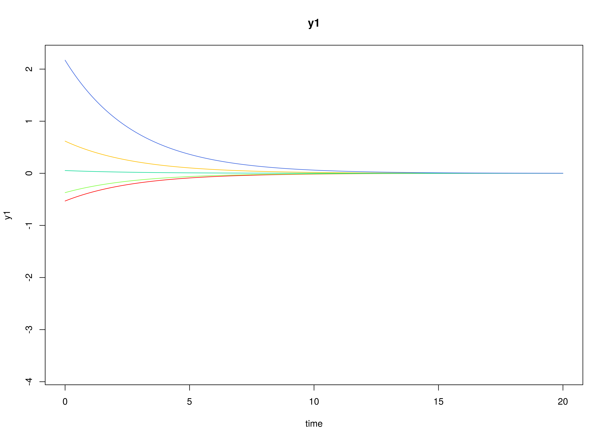
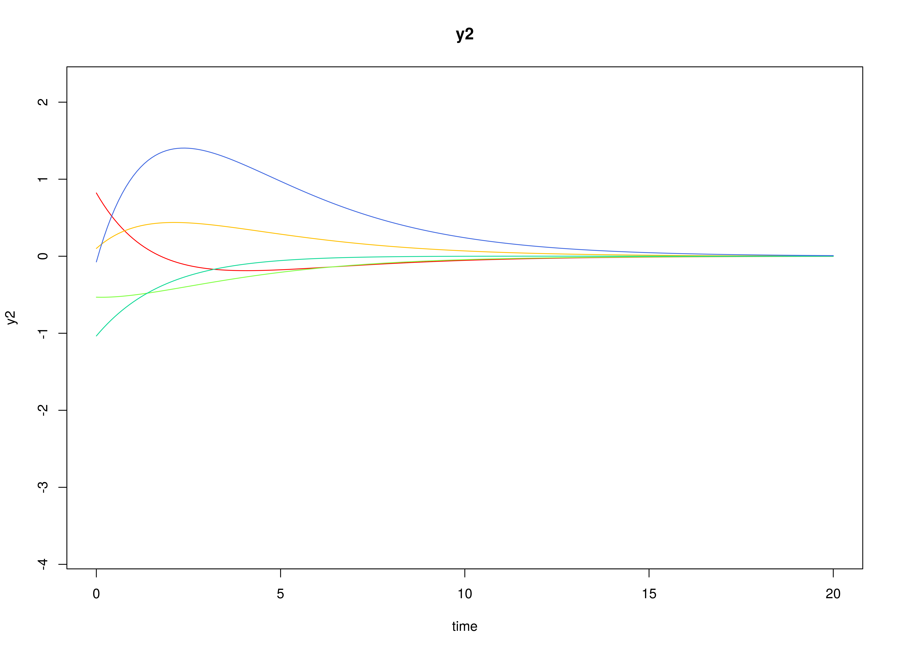
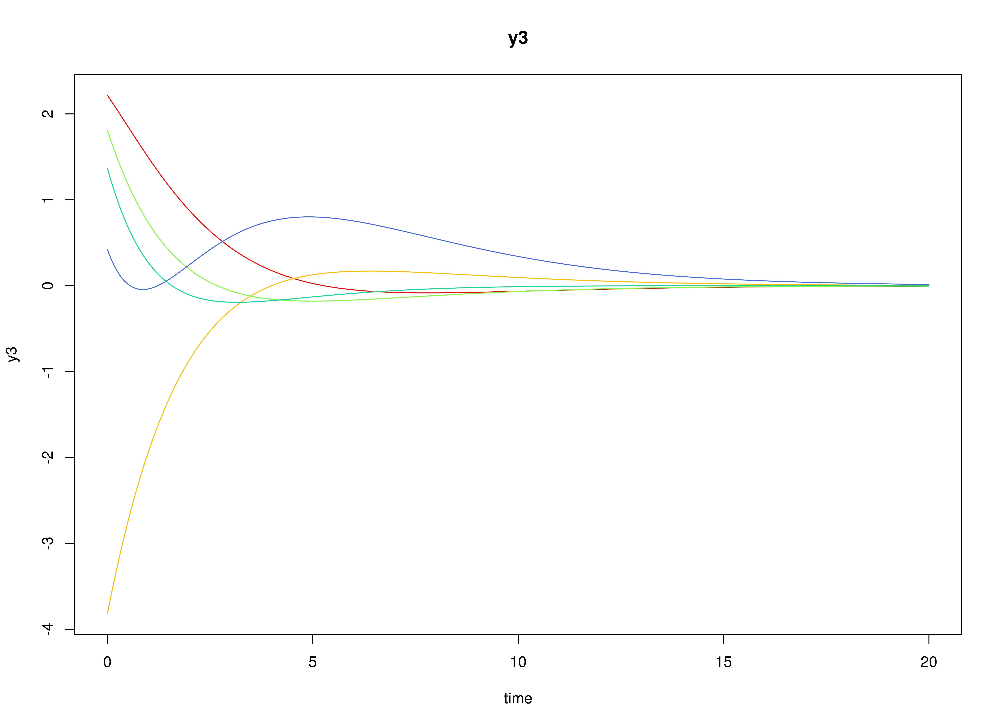

## Model

The measurement model is given by
\begin{equation}
  \mathbf{y}_{i, t}
  =
  \boldsymbol{\nu}
  +
  \boldsymbol{\Lambda}
  \boldsymbol{\eta}_{i, t}
  +
  \boldsymbol{\varepsilon}_{i, t},
  \quad
  \mathrm{with}
  \quad
  \boldsymbol{\varepsilon}_{i, t}
  \sim
  \mathcal{N}
  \left(
  \mathbf{0},
  \boldsymbol{\Theta}
  \right)
\end{equation}
where
$\mathbf{y}_{i, t}$,
$\boldsymbol{\eta}_{i, t}$,
and
$\boldsymbol{\varepsilon}_{i, t}$
are random variables
and
$\boldsymbol{\nu}$,
$\boldsymbol{\Lambda}$,
and
$\boldsymbol{\Theta}$
are model parameters.
$\mathbf{y}_{i, t}$
represents a vector of observed random variables,
$\boldsymbol{\eta}_{i, t}$
a vector of latent random variables,
and
$\boldsymbol{\varepsilon}_{i, t}$
a vector of random measurement errors,
at time $t$ and individual $i$.
$\boldsymbol{\nu}$
denotes a vector of intercepts,
$\boldsymbol{\Lambda}$
a matrix of factor loadings,
and
$\boldsymbol{\Theta}$
the covariance matrix of
$\boldsymbol{\varepsilon}$.

An alternative representation of the measurement error
is given by
\begin{equation}
  \boldsymbol{\varepsilon}_{i, t}
  =
  \boldsymbol{\Theta}^{\frac{1}{2}}
  \mathbf{z}_{i, t},
  \quad
  \mathrm{with}
  \quad
  \mathbf{z}_{i, t}
  \sim
  \mathcal{N}
  \left(
  \mathbf{0},
  \mathbf{I}
  \right)
\end{equation}
where
$\mathbf{z}_{i, t}$ is a vector of
independent standard normal random variables and
$\left( \boldsymbol{\Theta}^{\frac{1}{2}} \right) \left( \boldsymbol{\Theta}^{\frac{1}{2}} \right)^{\prime} = \boldsymbol{\Theta}$ .

The dynamic structure is given by
\begin{equation}
  \mathrm{d} \boldsymbol{\eta}_{i, t}
  =
  \boldsymbol{\Phi}
  \left(
  \boldsymbol{\eta}_{i, t}
  -
  \boldsymbol{\mu}
  \right)
  \mathrm{d}t
  +
  \boldsymbol{\Sigma}^{\frac{1}{2}}
  \mathrm{d}
  \mathbf{W}_{i, t}
\end{equation}
where
$\boldsymbol{\mu}$
is the long-term mean or equilibrium level,
$\boldsymbol{\Phi}$
is the rate of mean reversion,
determining how quickly the variable returns to its mean,
$\boldsymbol{\Sigma}$
is the matrix of volatility
or randomness in the process, and
$\mathrm{d}\boldsymbol{W}$
is a Wiener process or Brownian motion,
which represents random fluctuations.

## Data Generation

### Notation

Let $t = 1000$ be the number of time points and $n = 100$ be the number of individuals.

Let the measurement model intecept vector $\boldsymbol{\nu}$ be given by

\begin{equation}
\boldsymbol{\nu}
=
\left(
\begin{array}{c}
  0 \\
  0 \\
  0 \\
\end{array}
\right) .
\end{equation}

Let the factor loadings matrix $\boldsymbol{\Lambda}$ be given by

\begin{equation}
\boldsymbol{\Lambda}
=
\left(
\begin{array}{ccc}
  1 & 0 & 0 \\
  0 & 1 & 0 \\
  0 & 0 & 1 \\
\end{array}
\right) .
\end{equation}

Let the measurement error covariance matrix $\boldsymbol{\Theta}$ be given by

\begin{equation}
\boldsymbol{\Theta}
=
\left(
\begin{array}{ccc}
  0 & 0 & 0 \\
  0 & 0 & 0 \\
  0 & 0 & 0 \\
\end{array}
\right) .
\end{equation}

Let the initial condition
$\boldsymbol{\eta}_{0}$
be given by

\begin{equation}
\boldsymbol{\eta}_{0} \sim \mathcal{N} \left( \boldsymbol{\mu}_{\boldsymbol{\eta} \mid 0}, \boldsymbol{\Sigma}_{\boldsymbol{\eta} \mid 0} \right)
\end{equation}

\begin{equation}
\boldsymbol{\mu}_{\boldsymbol{\eta} \mid 0}
=
\left(
\begin{array}{c}
  0 \\
  0 \\
  0 \\
\end{array}
\right)
\end{equation}

\begin{equation}
\boldsymbol{\Sigma}_{\boldsymbol{\eta} \mid 0}
=
\left(
\begin{array}{ccc}
  1 & 0 & 0 \\
  0 & 1 & 0 \\
  0 & 0 & 1 \\
\end{array}
\right) .
\end{equation}

Let the long-term mean vector $\boldsymbol{\mu}$ be given by

\begin{equation}
\boldsymbol{\mu}
=
\left(
\begin{array}{c}
  0 \\
  0 \\
  0 \\
\end{array}
\right) .
\end{equation}

Let the rate of mean reversion matrix $\boldsymbol{\Phi}$ be given by

\begin{equation}
\boldsymbol{\Phi}
=
\left(
\begin{array}{ccc}
  -0.357 & 0 & 0 \\
  0.771 & -0.511 & 0 \\
  -0.45 & 0.729 & -0.693 \\
\end{array}
\right) .
\end{equation}

Let the dynamic process noise covariance matrix $\boldsymbol{\Sigma}$ be given by

\begin{equation}
\boldsymbol{\Sigma}
=
\left(
\begin{array}{ccc}
  0.1 & 0 & 0 \\
  0 & 0.1 & 0 \\
  0 & 0 & 0.1 \\
\end{array}
\right) .
\end{equation}

Let $\Delta t = 0.1$.

### R Function Arguments


``` r
n
#> [1] 100
time
#> [1] 1000
delta_t
#> [1] 0.1
mu0
#> [1] 0 0 0
sigma0
#>      [,1] [,2] [,3]
#> [1,]    1    0    0
#> [2,]    0    1    0
#> [3,]    0    0    1
mu
#> [1] 0 0 0
phi
#>        [,1]   [,2]   [,3]
#> [1,] -0.357  0.000  0.000
#> [2,]  0.771 -0.511  0.000
#> [3,] -0.450  0.729 -0.693
sigma
#>      [,1] [,2] [,3]
#> [1,]  0.1  0.0  0.0
#> [2,]  0.0  0.1  0.0
#> [3,]  0.0  0.0  0.1
nu
#> [1] 0 0 0
lambda
#>      [,1] [,2] [,3]
#> [1,]    1    0    0
#> [2,]    0    1    0
#> [3,]    0    0    1
theta
#>      [,1] [,2] [,3]
#> [1,]    0    0    0
#> [2,]    0    0    0
#> [3,]    0    0    0
```

### Visualizing the Dynamics Without Measurement Error and Process Noise (n = 5 with Different Initial Condition)



### Using the `SimSSMOUFixed` Function from the `simStateSpace` Package to Simulate Data


``` r
library(simStateSpace)
sim <- SimSSMOUFixed(
  n = n,
  time = time,
  delta_t = delta_t,
  mu0 = mu0,
  sigma0_l = sigma0_l,
  mu = mu,
  phi = phi,
  sigma_l = sigma_l,
  nu = nu,
  lambda = lambda,
  theta_l = theta_l,
  type = 0
)
data <- as.data.frame(sim)
head(data)
#>   id time         y1         y2        y3
#> 1  1  0.0 -0.3643096 -0.6026342 0.9065540
#> 2  1  0.1 -0.3256180 -0.5022615 0.8677814
#> 3  1  0.2 -0.2296496 -0.3203675 0.8569315
#> 4  1  0.3 -0.2413114 -0.3622560 0.7848573
#> 5  1  0.4 -0.3358543 -0.2430579 0.6294530
#> 6  1  0.5 -0.2806468 -0.2063894 0.5806752
plot(sim)
```


## Model Fitting

The `FitCTVARMx` function fits a DT-VAR model on each individual $i$.


``` r
library(fitCTVARMx)
fit <- FitCTVARMx(
  data = data,
  observed = paste0("y", seq_len(k)),
  id = "id",
  time = "time",
  ncores = parallel::detectCores()
)
#> Running CTVAR with 12 parameters
#> 
#> Beginning initial fit attempt
#> Running CTVAR with 12 parameters
#> 
#>  Lowest minimum so far:  -543716.980131128
#> 
#> Solution found
```



```
#> 
#>  Solution found!  Final fit=-543716.98 (started at -524291.52)  (1 attempt(s): 1 valid, 0 errors)
#>  Start values from best fit:
#> -0.336259079122471,0.770287067798403,-0.464190065239356,0.00205658765648727,-0.521492461088462,0.735878240731034,-0.0106374506388174,0.0129009602154161,-0.697095884475648,0.0994158716609205,0.100737065910388,0.10023245133394
fit
#> Summary of CTVAR 
#>  
#> free parameters:
#>        name        matrix  row  col     Estimate    Std.Error A
#> 1    phi_11   CTVAR_1.phi eta1 eta1 -0.336259079 0.0112876840  
#> 2    phi_21   CTVAR_1.phi eta2 eta1  0.770287068 0.0112334809  
#> 3    phi_31   CTVAR_1.phi eta3 eta1 -0.464190065 0.0111528376  
#> 4    phi_12   CTVAR_1.phi eta1 eta2  0.002056588 0.0097320464  
#> 5    phi_22   CTVAR_1.phi eta2 eta2 -0.521492461 0.0098184506  
#> 6    phi_32   CTVAR_1.phi eta3 eta2  0.735878241 0.0097176408  
#> 7    phi_13   CTVAR_1.phi eta1 eta3 -0.010637451 0.0089962429  
#> 8    phi_23   CTVAR_1.phi eta2 eta3  0.012900960 0.0090682626  
#> 9    phi_33   CTVAR_1.phi eta3 eta3 -0.697095884 0.0090833222  
#> 10 sigma_11 CTVAR_1.sigma eta1 eta1  0.099415872 0.0004590553  
#> 11 sigma_22 CTVAR_1.sigma eta2 eta2  0.100737066 0.0004614320  
#> 12 sigma_33 CTVAR_1.sigma eta3 eta3  0.100232451 0.0004571693  
#>                  lbound               ubound
#> 1                       2.2250738585072e-308
#> 2                                           
#> 3                                           
#> 4                                           
#> 5                       2.2250738585072e-308
#> 6                                           
#> 7                                           
#> 8                                           
#> 9                       2.2250738585072e-308
#> 10 2.2250738585072e-308                     
#> 11 2.2250738585072e-308                     
#> 12 2.2250738585072e-308                     
#> 
#> Model Statistics: 
#>                |  Parameters  |  Degrees of Freedom  |  Fit (-2lnL units)
#>        Model:             12                 299988               -543717
#>    Saturated:             NA                     NA                    NA
#> Independence:             NA                     NA                    NA
#> Number of observations/statistics: 1e+05/3e+05
#> 
#> Information Criteria: 
#>       |  df Penalty  |  Parameters Penalty  |  Sample-Size Adjusted
#> AIC:       -1143693              -543693.0                  -543693
#> BIC:       -3997456              -543578.8                  -543617
#> CFI: NA 
#> TLI: 1   (also known as NNFI) 
#> RMSEA:  0  [95% CI (NA, NA)]
#> Prob(RMSEA <= 0.05): NA
#> To get additional fit indices, see help(mxRefModels)
#> timestamp: 2024-08-02 18:08:42 
#> Wall clock time: 148.6983 secs 
#> optimizer:  SLSQP 
#> OpenMx version number: 2.21.11 
#> Need help?  See help(mxSummary)
```

## References


